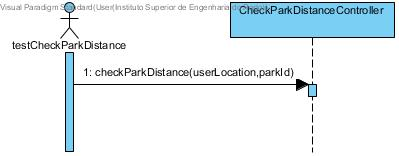
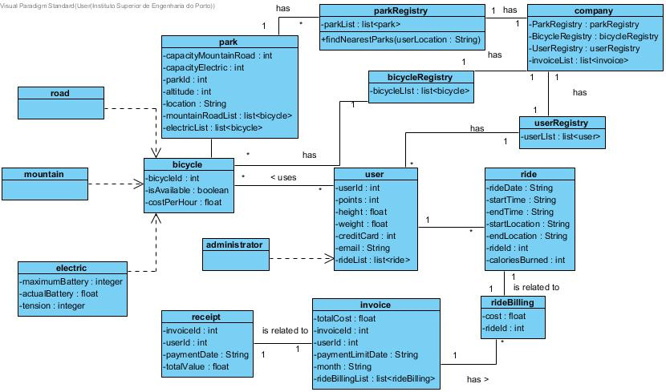

# README #

This is the repository template used for student repositories in LAPR Projets.

#REPORT


##Introduction
In this project there were applied concepts of analysis, modelling and object-oriented programming in order to develop a Java service that supports the management of a bicycle sharing business. 
In compliance with good practices learned and applied during the first semester, mainly on the course units of Applied Physics (FSIAP), Data Structures (ESINF) and Databases (BDDAD), an iterative and incremental development process was utilized during the process. An agile methodology based on Scrum was applied to manage the team’s work during each week of the project.
To increase software’s maintainability, analysis best practices, Object-Oriented (OO) software design was adopted and implementation was followed by a Test-Driven Development (TDD) approach. 

 
##Problem Description
A bicycle sharing company needs a software service and/or application that allows managing its bicycles, bicycle parks and users.
The company owns several bicycle parks, scattered around town, that are used for parking bicycles when those are not in use.
There are different kinds of bicycles to suit different types of costumers. 
There are road, mountain and electrically assisted bicycles. 
For users to gain access to the sharing service, the user registration has a cost. From there on, depending on the time each bicycle is loaned, a fee can be applied. 
To pick-up bicycles, users must request the application to unlock one of the available bicycles at the park. 
When dropping-off a bicycle, the user should be notified that the bicycle was properly left locked. 
There is also a system for crediting points based on certain user actions. 
For example, at the moment, when a user picks-up a bicycle and leaves it on park situated in a place with a higher elevation/altitude points are credited to the user. 
User’s monthly cost is issued to the user, by using invoices. 
Users’ points may be used to partially pay the invoice. 
After paying the invoice, users should get a receipt.
 
##Assessment
During the process of conceiving the application, we divided the given tasks in several Use Cases, each one with its own Analysis, Design and Implementation.

#DIAGRAMS
	# Requirements Engineering:
		## Use Case Diagram;
		
		
## System Sequence Diagram (SSD);

#LAPR3047-1
##Add bicycle :
 
As an administrator i want to add a new bicycle so that the users can have access to it.

#LAPR3047-2
##User registry:

As user, I want to register myself so that I can loan a bicycle.

#LAPR3047-3
##User log in:

As an user i want to log in the system so that I can use the application components.

#LAPR3047-4
##Add park :

As an administrator i want to add a new park so that the users can have access to it.

#LAPR3047-5
##Delete park : 

As an administrator i want to delete a existing park so that the users can't have access to it.

#LAPR3047-6
##Update park : 

As an administrator i want to update an existing park so that the users can have access to the newly updated park.

#LAPR3047-7
##Delete bicycle:

As an administrator i want to delete a bicycle so that the users won´t have access to it anymore.

#LAPR3047-8
##Update bicycle: 

As an administrator i want to update a existing bycicle so that the users can have access to the newly updated bycicle.	

#LAPR3047-10
##Find nearest parks :

As an user, I want to find the list of nearest parks so that I can get a bike.

#LAPR3047-11
##Find available bikes on park:

As an user, I want to find available bikes on a park so that I can get one

#LAPR3047-12
##Check park distance :

As an user, I want to check how far is another park, so that i can evaluate if i want to go there.

#LAPR3047-13
##Email confirmation:

As an user, I want to receive an email so that I have confirmation that the bycicle is correctly locked.

#LAPR3047-14
##Assign eletrical bycicle with apropriate charge :

As an user when I select a park as destination and an eletrical bicycle, I want to be given one with enough charge so that I can get there 

#LAPR3047-15
##Check available spots:

As an user, i want to check if the park that i have chosen as the destination has available spots so that i can park my bycicle

#LAPR3047-16
##Calories burnt between two bicycle parks :

As an user, I want to know the amount of calories burnt between two bycicle parks so that i can keep myself informed about my trip.

#LAPR3047-73
##Request bycicle unlock:

As a user, I want to request a bicycle to unclock at a park in order to ride it.

#LAPR3047-93
##Park bicycle : 

As a user, I want to park a bycicle at a park in order to end my ride

#LAPR3047-94
##Update Park Availability : 

As a user I want to update park availability so that the park has the correct available spots

#LAPR3047-95
##Charge User Account : 

As an user, I want my user account to be charged for the time I used the bike.

#LAPR3047-96
##Award points : 

As a user I want to get points considering the height difference between two parks 

#LAPR3047-97
##Load touristic point : 

As an administrator, I want to load points of interest to better handle routing between parks

#LAPR3047-98
##Changing battery pack : 

As an administrator, I want to change the battery pack when the battery pack needs it.

#LAPR3047-99
##Charge bicycle : 

As an administrator, i want to charge an electric bicycle for the next users.

#LAPR3047-100
##Split charging on a park : 

As an administrator, I want to make sure that the electrical charging circuit is already working to split the capacity to each charging point.

#LAPR3047-101
##Generate report for charging statuses:

As an administrator, i want an report to know the battery state of each bicycle.

#LAPR3047-102
##Estimate projection for charging:

As an administrator, i want to know how long time each bicycle need to charge till 100%

#LAPR3047-103
##Add wind support information : 

As an administrator, I want to add wind support information so that wind information is considered when travelling between two locations.


#LAPR3047-106
##Shortest route between two parks :

As a user I want to know the shortest route between two parks so that I can take it


#LAPR3047-107
##Most energetically efficient route between two parks:

As a user I want to know the most energetically efficient route between two parks so that I can take it.


#LAPR3047-108
##Shortest route with interest points :

As a user I want to know the shortest route between two parks that goes by at least a certain number of interest points so that I can take it

#LAPR3047-169
##Shortest route between two parks :

As a user I want to know the shortest route between two parks so that I can take it.

#LAPR2047-171
##Update Invoice Price : 

As an user, I want to use my points in order to reduce the invoice price. 

#LAPR2047-173
##Suggest Routes : 

As an user I want to know a certain number of routes, provided with a certain number of interest points in-between.

#LAPR2047-174
##Sort suggested routes: 

As an user, I want to sort the suggested routes by ascending or descending order for total distande, energy efficiency,etc. .

#LAPR2047-175
##Check where wind's facing: 

As an Administrator, I want to calculate the bearing between two locations to check where the wind is facing 
	
# Requirements Engineering:
	# Engineering Analysis:
		## Domain Model (DM);
		
	
# Engineering Design:
		## Class Diagram (CD);
#LAPR3047-1
##Add bicycle :
 
As an administrator i want to add a new bicycle so that the users can have access to it.

#LAPR3047-2
##User registry:
 
As user, I want to register myself so that I can loan a bicycle.

#LAPR3047-3
##User log in:

As an user i want to log in the system so that I can use the application components.

#LAPR3047-4
##Add park :

As an administrator i want to add a new park so that the users can have access to it.

#LAPR3047-5
##Delete park : 

As an administrator i want to delete a existing park so that the users can't have access to it.

#LAPR3047-6
##Update park : 

As an administrator i want to update an existing park so that the users can have access to the newly updated park.

#LAPR3047-7
##Delete bicycle:

As an administrator i want to delete a bicycle so that the users won´t have access to it anymore.

#LAPR3047-8
##Update bicycle: 

As an administrator i want to update a existing bycicle so that the users can have access to the newly updated bycicle.	

#LAPR3047-10
##Find nearest parks :

As an user, I want to find the list of nearest parks so that I can get a bike.

#LAPR3047-11
##Find available bikes on park:

As an user, I want to find available bikes on a park so that I can get one

#LAPR3047-12
##Check park distance :

As an user, I want to check how far is another park, so that i can evaluate if i want to go there.

#LAPR3047-13
##Email confirmation:

As an user, I want to receive an email so that I have confirmation that the bycicle is correctly locked.

#LAPR3047-14
##Assign eletrical bycicle with apropriate charge :

As an user when I select a park as destination and an eletrical bicycle, I want to be given one with enough charge so that I can get there 

#LAPR3047-15
##Check available spots:

As an user, i want to check if the park that i have chosen as the destination has available spots so that i can park my bycicle

#LAPR3047-16
##Calories burnt between two bicycle parks :

As an user, I want to know the amount of calories burnt between two bycicle parks so that i can keep myself informed about my trip.

#LAPR3047-73
##Request bycicle unlock:

As a user, I want to request a bicycle to unclock at a park in order to ride it.

#LAPR3047-93
##Park bicycle : 

As a user, I want to park a bycicle at a park in order to end my ride

#LAPR3047-94
##Update Park Availability : 

As a user I want to update park availability so that the park has the correct available spots

#LAPR3047-95
##Charge User Account : 

As an user, I want my user account to be charged for the time I used the bike.

#LAPR3047-96
##Award points : 

As a user I want to get points considering the height difference between two parks 

#LAPR3047-97
##Load touristic point : 

As an administrator, I want to load points of interest to better handle routing between parks

#LAPR3047-98
##Changing battery pack : 

As an administrator, I want to change the battery pack when the battery pack needs it.

#LAPR3047-99
##Charge bicycle : 

As an administrator, i want to charge an electric bicycle for the next users.

#LAPR3047-100
##Split charging on a park : 

As an administrator, I want to make sure that the electrical charging circuit is already working to split the capacity to each charging point.

#LAPR3047-101
##Generate report for charging statuses:

As an administrator, i want an report to know the battery state of each bicycle.

#LAPR3047-102
##Estimate projection for charging:

As an administrator, i want to know how long time each bicycle need to charge till 100%

#LAPR3047-103
##Add wind support information : 

As an administrator, I want to add wind support information so that wind information is considered when travelling between two locations.


#LAPR3047-106
##Shortest route between two parks :

As a user I want to know the shortest route between two parks so that I can take it


#LAPR3047-107
##Most energetically efficient route between two parks:

As a user I want to know the most energetically efficient route between two parks so that I can take it.


#LAPR3047-108
##Shortest route with interest points :

As a user I want to know the shortest route between two parks that goes by at least a certain number of interest points so that I can take it

#LAPR3047-169
##Shortest route between two parks :

As a user I want to know the shortest route between two parks so that I can take it.

#LAPR2047-171
##Update Invoice Price : 

As an user, I want to use my points in order to reduce the invoice price. 

#LAPR2047-173
##Suggest Routes : 

As an user I want to know a certain number of routes, provided with a certain number of interest points in-between.

#LAPR2047-174
##Sort suggested routes: 

As an user, I want to sort the suggested routes by ascending or descending order for total distande, energy efficiency,etc. .

#LAPR2047-175
##Check where wind's facing: 

As an Administrator, I want to calculate the bearing between two locations to check where the wind is facing 


		## Sequence Diagram (SD);

#LAPR3047-1
##Add bicycle :
 
As an administrator i want to add a new bicycle so that the users can have access to it.

#LAPR3047-2
##User registry:

As user, I want to register myself so that I can loan a bicycle.

#LAPR3047-3
##User log in:

As an user i want to log in the system so that I can use the application components.

#LAPR3047-4
##Add park :

As an administrator i want to add a new park so that the users can have access to it.

#LAPR3047-5
##Delete park : 

As an administrator i want to delete a existing park so that the users can't have access to it.

#LAPR3047-6
##Update park : 

As an administrator i want to update an existing park so that the users can have access to the newly updated park.

#LAPR3047-7
##Delete bicycle:

As an administrator i want to delete a bicycle so that the users won´t have access to it anymore.

#LAPR3047-8
##Update bicycle: 

As an administrator i want to update a existing bycicle so that the users can have access to the newly updated bycicle.	

#LAPR3047-10
##Find nearest parks :

As an user, I want to find the list of nearest parks so that I can get a bike.

#LAPR3047-11
##Find available bikes on park:

As an user, I want to find available bikes on a park so that I can get one

#LAPR3047-12
##Check park distance :

As an user, I want to check how far is another park, so that i can evaluate if i want to go there.

#LAPR3047-13
##Email confirmation:

As an user, I want to receive an email so that I have confirmation that the bycicle is correctly locked.

#LAPR3047-14
##Assign eletrical bycicle with apropriate charge :

As an user when I select a park as destination and an eletrical bicycle, I want to be given one with enough charge so that I can get there 

#LAPR3047-15
##Check available spots:

As an user, i want to check if the park that i have chosen as the destination has available spots so that i can park my bycicle

#LAPR3047-16
##Calories burnt between two bicycle parks :

As an user, I want to know the amount of calories burnt between two bycicle parks so that i can keep myself informed about my trip.

* *Problem* *
There was a need for the user to know the ammount of calories burned between two bicycle parks.

* *Solution* *
For this use case, we decided to use the CaloriesBurntController to manage the calculation of the calories burned , using the initial and final locations, the users weight and the type in the method CalculateCaloriesBurnt.


#LAPR3047-73
##Request bycicle unlock:

As a user, I want to request a bicycle to unclock at a park in order to ride it.

* *Problem* *
There was a need for a user to request a bike to be unlocked in order for him to use it.

* *Solution* *
For this use case, we decided to use the RequestBicycleUnlockController to request the bike to be unlocked by requesting the list of available bikes on the method getListAvailableBikes() and setting the bicycle's state to taken in the method setBiycleState() and 	adding it to the list of taken bikes in the method setListTakenBikes(), also removing it from the list of vailable bikes in the method setListAvailableBikes().

#LAPR3047-93
##Park bicycle : 

As a user, I want to park a bycicle at a park in order to end my ride

* *Problem* *
There was a need for a user to request a bike to be unlocked in order for him to use it.

* *Solution* *
For this use case, we decided to use the RequestBicycleUnlockController to request the bike to be unlocked by requesting the list of available bikes on the method getListAvailableBikes() and setting the bicycle's state to taken in the method setBiycleState() and 	adding it to the list of taken bikes in the method setListTakenBikes(), also removing it from the list of vailable bikes in the method setListAvailableBikes().

#LAPR3047-94
##Update Park Availability : 

As a user I want to update park availability so that the park has the correct available spots

#LAPR3047-95
##Charge User Account : 

As an user, I want my user account to be charged for the time I used the bike.

#LAPR3047-96
##Award points : 

As a user I want to get points considering the height difference between two parks 

#LAPR3047-97
##Load touristic point : 

As an administrator, I want to load points of interest to better handle routing between parks

#LAPR3047-98
##Changing battery pack : 


#LAPR3047-99
##Charge bicycle : 

As an administrator, i want to charge an electric bicycle for the next users.

#LAPR3047-100
##Split charging on a park : 

As an administrator, I want to make sure that the electrical charging circuit is already working to split the capacity to each charging point.


#LAPR3047-101
##Generate report for charging statuses:

As an administrator, i want an report to know the battery state of each bicycle.

#LAPR3047-102
##Estimate projection for charging:

As an administrator, i want to know how long time each bicycle need to charge till 100%

* **Problem:**
An administrator should be able to get a report for a specific park, stating the current charging status for each bicycle and an estimate projection for how long it would take for each bicycle to reach 100% charge under the existing circumstances.

* **Solution:**
In this use case we decided to use the estimateProjectionForChargingController to Calculate the estimate projection for how long it would take for each bicycle to reach 100% charge using the method calculateEstimateProjectionForChargingController().

#LAPR3047-103
##Add wind support information : 

As an administrator, I want to add wind support information so that wind information is considered when travelling between two locations.

#LAPR3047-106
##Shortest route between two parks :

As a user I want to know the shortest route between two parks so that I can take it


#LAPR3047-107
##Most energetically efficient route between two parks:

As a user I want to know the most energetically efficient route between two parks so that I can take it.

* **Problem:**
When requesting a bicycle, the user should be given more choices about the routes that may be chosen from, for example:
	• The most energetically efficient route between two parks;

* **Solution:**
In this use case we used the methor shortestPathEnergySpent() to find the most energitically efficient route between two parks.


#LAPR3047-108
##Shortest route with interest points :

As a user I want to know the shortest route between two parks that goes by at least a certain number of interest points so that I can take it

#LAPR3047-169
##Shortest route between two parks :

As a user I want to know the shortest route between two parks so that I can take it.

#LAPR2047-171
##Update Invoice Price : 

As an user, I want to use my points in order to reduce the invoice price. 

#LAPR2047-173
##Suggest Routes : 

As an user I want to know a certain number of routes, provided with a certain number of interest points in-between.

#LAPR2047-174
##Sort suggested routes: 

As an user, I want to sort the suggested routes by ascending or descending order for total distande, energy efficiency,etc. .

#LAPR2047-175
##Check where wind's facing: 

As an Administrator, I want to calculate the bearing between two locations to check where the wind is facing 

* **Problem:**
The wind sensors used for collecting wind speed and direction are now more accurate than before. These sensors can now provide the wind direction in degrees. In order to understand how the wind affects travelling from one location to another, it is necessary to calculate the bearing between location A and location B3 to check if the wind if facing forward, backwards or sideways. When no wind information is provided between two locations, you should assume there is no wind between those two points.

* **Solution:**
In this use case we use the method calculateBearing() using the information in degrees given by the wind direction to check where the wind was facing.


		## Entity-Relationship Diagram (ER);
		


#Java source files

Java source and test files are located in folder src.

# Maven files #

Pom.xml file controls the project build.
## Observations
In this file, DO NOT EDIT the following elements:

* groupID
* artifactID
* version
* properties

Also, students can only add dependencies to the specified section on this file.

# Eclipse files #

The following files are solely used by Eclipse IDE:

* .classpath
* .project

# IntelliJ Idea IDE files #

The following folder is solely used by Intellij Idea IDE :

* .idea

## How was the .gitignore file generated? ##
.gitignore file was generated based on https://www.gitignore.io/ with the following keywords:
  - Java
  - Maven
  - Eclipse
  - NetBeans
  - Intellij

## Who do I talk to? ##
In case you have any problem, please email Nuno Bettencourt (nmb@isep.ipp.pt).

## How do I use Maven? ##

### How to run unit tests? ###
Execute the "test" goals.
`$ mvn test`

### How to generate the javadoc for source code? ###
Execute the "javadoc:javadoc" goal.

`$ mvn javadoc:javadoc`

This generates the source code javadoc in folder "target/site/apidocs/index.html".

### How to generate the javadoc for test cases code? ###
Execute the "javadoc:test-javadoc" goal.

`$ mvn javadoc:test-javadoc`

This generates the test cases javadoc in folder "target/site/testapidocs/index.html".

### How to generate Jacoco's Code Coverage Report? ###
Execute the "jacoco:report" goal.

`$ mvn test jacoco:report`

This generates a jacoco code coverage report in folder "target/site/jacoco/index.html".

### How to generate PIT Mutation Code Coverage? ###
Execute the "org.pitest:pitest-maven:mutationCoverage" goal.

`$ mvn test org.pitest:pitest-maven:mutationCoverage`

This generates a PIT Mutation coverage report in folder "target/pit-reports/YYYYMMDDHHMI".

### How to combine different maven goals in one step? ###
You can combine different maven goals in the same command. For example, to locally run your project just like on jenkins, use:

`$ mvn clean test jacoco:report org.pitest:pitest-maven:mutationCoverage`

# Oracle repository

If you get the following error:

```
[ERROR] Failed to execute goal on project 
bike-sharing: Could not resolve dependencies for project 
lapr3:bike-sharing:jar:1.0-SNAPSHOT: 
Failed to collect dependencies at 
com.oracle.jdbc:ojdbc7:jar:12.1.0.2: 
Failed to read artifact descriptor for 
com.oracle.jdbc:ojdbc7:jar:12.1.0.2: 
Could not transfer artifact 
com.oracle.jdbc:ojdbc7:pom:12.1.0.2 
from/to maven.oracle.com (https://maven.oracle.com): 
Not authorized , ReasonPhrase:Authorization Required. 
-> [Help 1]
```

Follow these steps:

https://blogs.oracle.com/dev2dev/get-oracle-jdbc-drivers-and-ucp-from-oracle-maven-repository-without-ides

You do not need to set a proxy..
